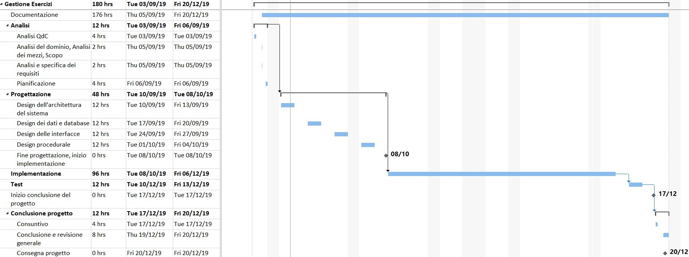

# Gestione Esercizi | Diario di lavoro - 06.09.2019
##### Gabriele Alessi
### Canobbio, 06.09.2019

## Lavori svolti

Durante questa giornata mi sono occupato inizialmente di sviluppare la pianificazione del progetto tramite la realizzazione di un diagramma di Gantt con MS Project.

Dopo aver fatto ciò ho rifinito la documentazione in modo da concludere l'analisi del progetto ed essere pronto per iniziare la progettazione.

Infine ho reinstallato MS Visio così da realizzare lo schema dei casi d'uso, ma ho già l'idea di come realizzarlo (https://moodle.edu.ti.ch/cpt/pluginfile.php/7717/mod_folder/content/0/Esempi%20Use%20Case.pdf?forcedownload=1).

| Orario | Lavori svolti |
| - | - |
|13:15 - 16:30 | Pianificazione, Analisi e Documentazione |

##  Problemi riscontrati e soluzioni adottate

All'inizio ho avuto problemi con MS Project in quanto ho iniziato il progetto senza configurare le impostazioni corrette.  
Dopo essermi consultato con qualche compagno e docente sono riuscito a impostare il file e ho completato il Gantt.

##  Punto della situazione rispetto alla pianificazione

In linea con la pianificazione.

## Programma di massima per la prossima giornata di lavoro

Progettazione (design dell'architettura del sistema), documentazione.