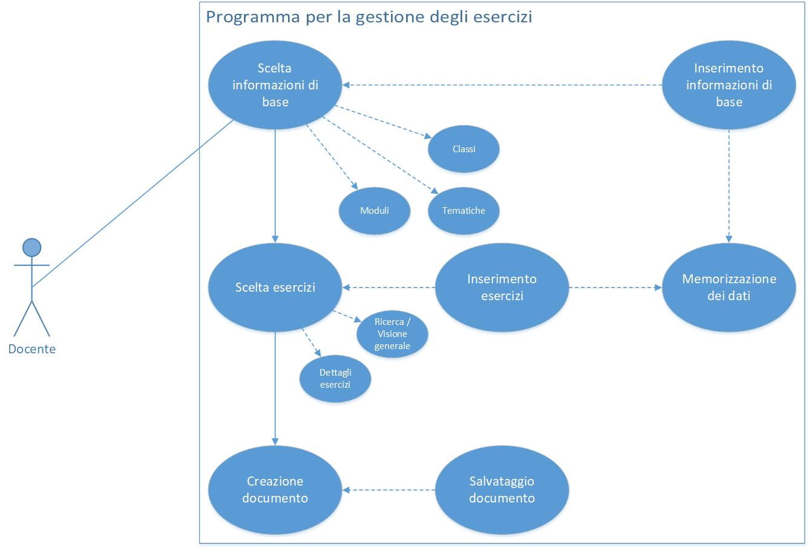
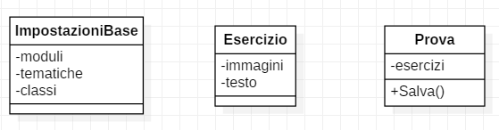

# Gestione Esercizi | Diario di lavoro - 10.09.2019
##### Gabriele Alessi
### Canobbio, 10.09.2019

## Lavori svolti

Durante questa giornata ho prima di tutto riguardato velocemente e poi concluso l'analisi del progetto (facendo anche lo use case), quindi ho cominciato a pensare al capitolo della progettazione.  
Questo è lo schema per i casi d'uso che ho realizzato:

Per il resto della lezione ho lavorato al design dell'architettura del sistema. In particolare ho cominciato il diagramma delle classi del prodotto, mettendo giù gli elementi principali.

A fine giornata ho deciso di lasciare in sospeso il diagramma delle classi per fare lo schema del database. In questo modo sarà più facile vedere il progetto nel suo complesso e definire le classi.  
In generale ora ho un'idea più chiara del sistema quindi durante le prossime occasioni dovrebbe iniziare a formarsi qualcosa di concreto.

| Orario | Lavori svolti |
| - | - |
|13:15 - 16:30 | Progettazione e Documentazione |

##  Problemi riscontrati e soluzioni adottate

Nessun problema riscontrato.

##  Punto della situazione rispetto alla pianificazione

In linea con la pianificazione.

## Programma di massima per la prossima giornata di lavoro

Progettazione (database), documentazione.  