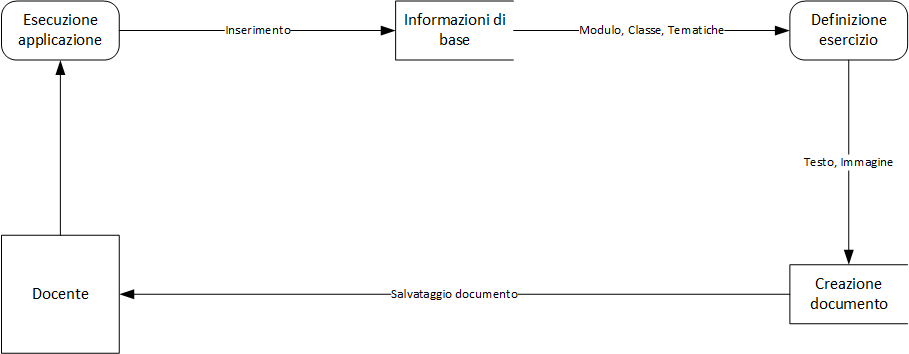

# Gestione Esercizi | Diario di lavoro - 12.09.2019
##### Gabriele Alessi
### Canobbio, 12.09.2019

## Lavori svolti

All'inizio di questa giornata mi sono subito preparato per progettare il database dell'applicazione. Per pensare a ciò ho riguardato il QdC e la documentazione che sviluppato finora. In sintesi questo sarà il modo in cui realizzerò lo schema:
- Definizione delle entità
- Definizione degli attributi
- Definizione delle relazioni
- Completamento dello schema (cardinalità, primary key, ...)
- Schema logico

Questo è il diagramma progettato:

Prossimamente farò controllare lo schema al supervisore in modo da sapere che eventuali modifiche apportare.  
Dopo aver fatto ciò ho iniziato il diagramma di flusso dei dati e il risultato è il seguente:

Questi schemi sono abbastanza grezzi quindi aspetto il parere del responsabile per sapere come muovermi in futuro.

| Orario | Lavori svolti |
| - | - |
|13:15 - 16:30 | Progettazione e Documentazione |

##  Problemi riscontrati e soluzioni adottate

La fase di progettazione per me è un po' lenta quindi ho avuto problemi a ideare gli schemi e il sistema in generale. Alla fine sono riuscito a concludere qualcosa ma spero di non ritrovarmi indietro con la tabella di marcia in futuro.

##  Punto della situazione rispetto alla pianificazione

In linea con la pianificazione.

## Programma di massima per la prossima giornata di lavoro

Progettazione, documentazione.  