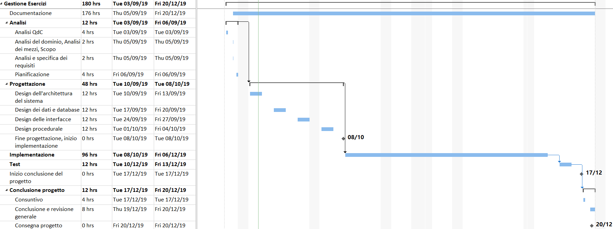

# Gestione Esercizi | Diario di lavoro - 13.09.2019
##### Gabriele Alessi
### Canobbio, 13.09.2019

## Lavori svolti

Oggi ho continuato a lavorare principalmente sulla progettazione del progetto. Purtroppo il responsabile non è stato presente quindi non ho potuto consultarlo riguardo ai diagrammi sviluppati durante la giornata precedente. Quindi ho prima di tutto riguardato la documentazione per riprendere il punto della situazione e così ho deciso di cominciare a pensare al vero e proprio progetto di C# in modo da preparare il capitolo riguardante il design dell'architettura del sistema.  
Qui di seguito un estratto di quest'ultimo:

```
Il programma è sviluppato in C# utilizzando il pattern MVVM, ma ci sono altri componenti per semplificare il lavoro che sono spiegati nel capitolo di implementazione. La struttura del progetto parte da una Soluzione Vuota che contiene un’app WPF dove vengono gestite le interfacce e una libreria di classi in cui vengono gestiti i dati.
```

Successivamente è intervenuto il docente Valsangiacomo per farci notare che nella pianificazione non andava inclusa la presentazione, dunque ho fatto delle piccole modifiche per togliere l'attività.  
Questo è il risultato definitivo:



Per il resto del tempo guardato un po' come fare per la creazione del progetto. Per quanto riguarda ciò ho avuto problemi visto che dovrei chiedere come impostare la base di progetto che ci è stata consegnato l'anno scorso in modo da avere la struttura già pronta.

| Orario | Lavori svolti |
| - | - |
|13:15 - 16:30 | Progettazione e Documentazione |

##  Problemi riscontrati e soluzioni adottate

Nessun problema riscontrato

##  Punto della situazione rispetto alla pianificazione

In linea con la pianificazione.

## Programma di massima per la prossima giornata di lavoro

Progettazione, documentazione.  