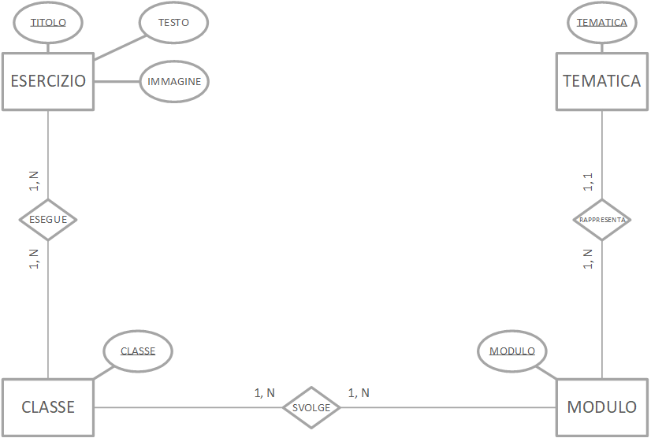

# Gestione Esercizi | Diario di lavoro - 17.09.2019
##### Gabriele Alessi
### Canobbio, 17.09.2019

## Lavori svolti

Durante questa giornata ho continuato principalmente con la progettazione e la documentazione del progetto. Inizialmente mi sono consultato con il supervisore per quanto riguarda gli schemi e diagrammi che ho realizzato finora. Quindi ho provveduto a riguardarli per metterli a posto e infine ho cominciato a pensare al design delle interfacce del prodotto.  
Il seguente è il database aggiornato:

> L’immagine seguente rappresenta la progettazione del database del sistema. In generale non è un diagramma molto articolato quindi da esso si può più o meno capire anche la struttura del sistema. 

> Le entità come tematica, classe, anno e modulo presenteranno bene o male sempre gli stessi valori in quanto rappresentano le impostazioni di base. Dopodiché ci sono le entità che simboleggiano gli esercizi e le prove, le quali sono relazionate tramite l’anno e il modulo. L’oggetto esercizio prova funge da collegamento tra prova e esercizio in modo che sia più facile gestire gli esercizi che si trovano nelle prove.

Ora che ho fatto il colloquio ho una visione molto più chiara del sistema del programma. Inoltre durante le prossime giornate mi verrà fornita la base del progetto Visual Studio in modo da sapere esattamente come disporre gli elementi del progetto.

In più ho anche rivisto lo schema del design procedurale e so come mettere a posto anche quello dopo aver rifatto il database.

| Orario | Lavori svolti |
| - | - |
|13:15 - 16:30 | Progettazione e Documentazione |

##  Problemi riscontrati e soluzioni adottate

Nessun problema riscontrato.

##  Punto della situazione rispetto alla pianificazione

In linea con la pianificazione.  
Concluso 2.2 Design dei dati e database

## Programma di massima per la prossima giornata di lavoro

Progettazione, documentazione.