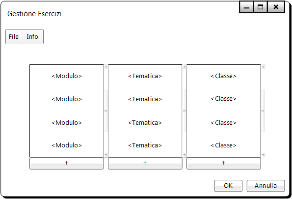

# Gestione Esercizi | Diario di lavoro - 19.09.2019
##### Gabriele Alessi
### Canobbio, 19.09.2019

## Lavori svolti

Durante questa giornata mi sono principalmente occupato di progettare il design delle interfacce del programma.  
La prima che ho sviluppato è stata la schermata di base:

> La prima schermata è molto semplice e presenta solamente tre pulsanti che rappresentano le tre azioni principali del programma.

Successivamente ho concluso anche l'interfaccia che gestisce le impostazioni di base:

> Questa schermata è composta da tre menu in cui si può scorrere per vedere i dati inseriti (moduli, tematiche e classi) e i relativi pulsanti per aggiungere un nuovo elemento.  
L’interfaccia sembra molto semplice, ma dietro ci sono anche alcune funzionalità che permettono di collegare queste tre entità tra loro e gestirle:  
> - Doppio click su una classe  
Mostra i moduli che essa svolge e permette di gestirli.
> - Doppio click su un modulo  
Mostra le tematiche che esso comprende e permette di gestirli.
> - Click + delete su un elemento lo elimina.
>
> Infine ci sono i soliti pulsanti che consentono di annullare o applicare le eventuali modifiche apportate.

| Orario | Lavori svolti |
| - | - |
|13:15 - 16:30 | Progettazione e Documentazione |

##  Problemi riscontrati e soluzioni adottate

Dovrei consultarmi con il responsabile per quanto riguarda il collegamento degli elementi nelle impostazioni di base (una classe che moduli segue e un modulo che tematiche presenta). In generale sto riuscendo a sviluppare qualcosa ma non sono sicuro su come progettare alcuni aspetti che si trovano nelle impostazioni di base.

##  Punto della situazione rispetto alla pianificazione

In linea con la pianificazione.

## Programma di massima per la prossima giornata di lavoro

Progettazione, documentazione.