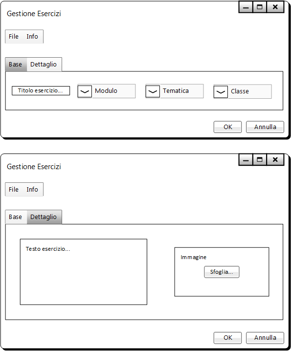
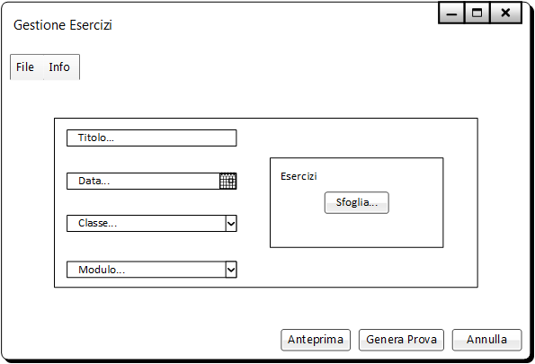
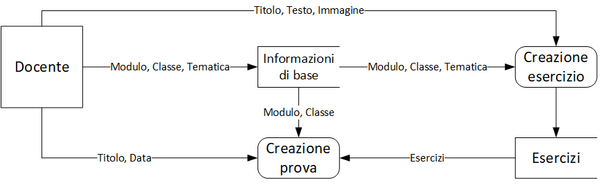

# Gestione Esercizi | Diario di lavoro - 20.09.2019
##### Gabriele Alessi
### Canobbio, 20.09.2019

## Lavori svolti

Durante questa giornata ho concluso la progettazione del design delle interfacce del programma.  
Questa è la schermata che crea gli esercizi:

> 
>
>La prima maschera consente di attribuire un titolo all’esercizio e di scegliere tramite un menu a tendina le informazioni di base stabilite nell’applicazione.  
Nell’altra maschera è possibile comporre il testo dell’esercizio e inserire un’immagine attraverso Drag & Drop oppure sfogliando tra i file. Se si clicca “OK” il programma genererà un file RFT con il contenuto del testo e dell’immagine.

L'ultima interfaccia è quella che riguarda la creazione di una prova:

> 
>
>Nel primo campo si scrive il titolo della prova, nel secondo si inserisce la data (anche con l’aiuto del calendario), poi si inseriscono classe e modulo, che vengono estrapolati sempre dalle impostazioni di base. Finalmente si aggiungono gli esercizi tramite Drag & Drop o sfogliando tra i propri file. 
Per avere un’anteprima della prova esiste un apposito pulsante che mostrerà un’altra finestra con ciò che produrrà il programma se si dovesse generare il file.

A fine giornata ho avuto anche il tempo di rifare il diagramma di flusso dei dati:

| Orario | Lavori svolti |
| - | - |
|13:15 - 16:30 | Progettazione e Documentazione |

##  Problemi riscontrati e soluzioni adottate

Nessun problema riscontrato.

##  Punto della situazione rispetto alla pianificazione

In linea con la pianificazione.

## Programma di massima per la prossima giornata di lavoro

Progettazione, documentazione.