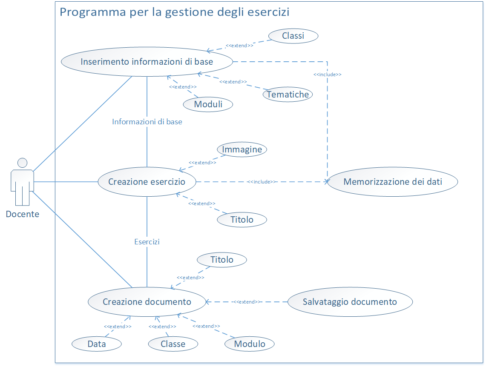

# Gestione Esercizi | Diario di lavoro - 26.09.2019
##### Gabriele Alessi
### Canobbio, 26.09.2019

## Lavori svolti

Durante questa giornata ho lavorato in modo da concludere la progettazione e il resto del progetto così da poter iniziare l'implementazione dell'applicazione.  
Prima di tutto ho sviluppato l'abstract:
>The teachers of the Scuola d’Arti e Mestieri di Trevano use to create the exercises and the tests without any type of help from a tool or system. This project consists of creating a computer program that allows you to create and manage the exercises and the tests quickly and easily. In detail, the program works so you can set up the basic info (subjects, classes and themes) to then use them to create the exercises. 
When you create an exercise, you have a global vision of the basic settings and then you can define the text and eventually insert an image. Finally, you can create the document by entering the fundamental fields (title, date, class and subject) and selecting the related exercises. 
The application is entirely developed in C# MVVM with Visual Studio 2019 and for the data storage, SQLite is used.

Inoltre dopo la progettazione ho avuto un'idea più chiara anche per quanto riguarda lo use case, quindi questa è la versione sistemata definitiva:

Infine ho approfittato per iniziare il progetto su Visual Studio e definire le basi dell'applicazione. In concreto ho creato una Soluzione Vuota con un App WPF che gestirà l'intero sistema e ho iniziato a creare le classi modello principali (classe, modulo, tematica). Prossimamente dovrò definire l'intero progetto possibilmente anche dopo aver consultato il supervisore così da iniziare la vera implementazione dei moduli.

| Orario | Lavori svolti |
| - | - |
|13:15 - 16:30 | Conclusione progettazione e Documentazione |

##  Problemi riscontrati e soluzioni adottate

Nessun problema riscontrato.

##  Punto della situazione rispetto alla pianificazione

In anticipo di circa una settimana con la pianificazione. 

## Programma di massima per la prossima giornata di lavoro

Implementazione, documentazione.