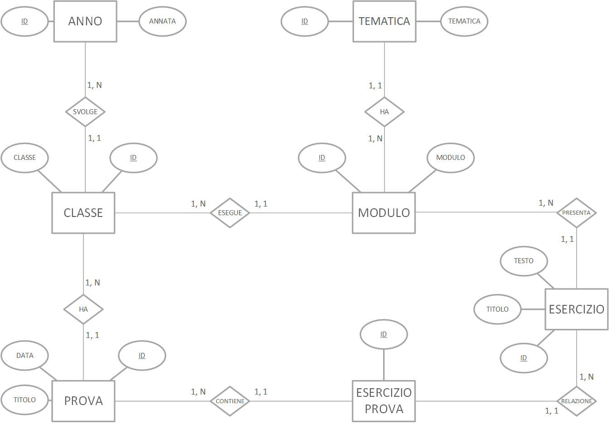

# Gestione Esercizi | Diario di lavoro - 03.12.2019

##### Gabriele Alessi

### Canobbio, 03.12.2019

## Lavori svolti

Durante questa giornata ho inizialmente avuto l'occasione di consultarmi con il docente per risolvere i problemi relativi all'inserimento di nuovi dati nel database. Mentre osservavamo il database è venuto fuori che ci sono un paio di incongruenze per quanto riguarda la relazione Anno-Classe. Quindi ho dovuto ristrutturare lo schema dei dati fondamentalmente scambiando le due entità.

```c#
public class Classe
{
    public string Nome { get; set; }
    public virtual Anno Anno { get; set; }
    public virtual ICollection<Modulo> Moduli { get; set; }
    public virtual ICollection<Prova> Prove { get; set; }
}

public class Anno
{
    public string Annata { get; set; }
    public virtual ICollection<Classe> Classi { get; set; }
}
```

Per risolvere il problema dell'inserimento nel database è necessario implementare una proprietà relativa all'ID dell'entità esterna in modo che funzioni come una foreign key.

```c#
public string Nome { get; set; }
public virtual Anno Anno { get; set; }
public int AnnoId { get; set; }

public Classe(string nome, Anno anno)
{
    Nome = nome;
    AnnoId = anno.Id;
}
```

<div style="page-break-after: always;"></div>

Nel frattempo ho provveduto anche aggiornando la documentazione perfezionando anche i capitoli relativi alle interfacce e ai ViewModels e creando il nuovo schema del database.



| Orario | Lavori svolti |
| - | - |
|13:15 - 16:30 | Implementazione e Documentazione |

## Problemi riscontrati e soluzioni adottate

Nessun problema riscontrato.

## Punto della situazione rispetto alla pianificazione

In linea con la pianificazione.

## Programma di massima per la prossima giornata di lavoro

Implementazione, documentazione.
