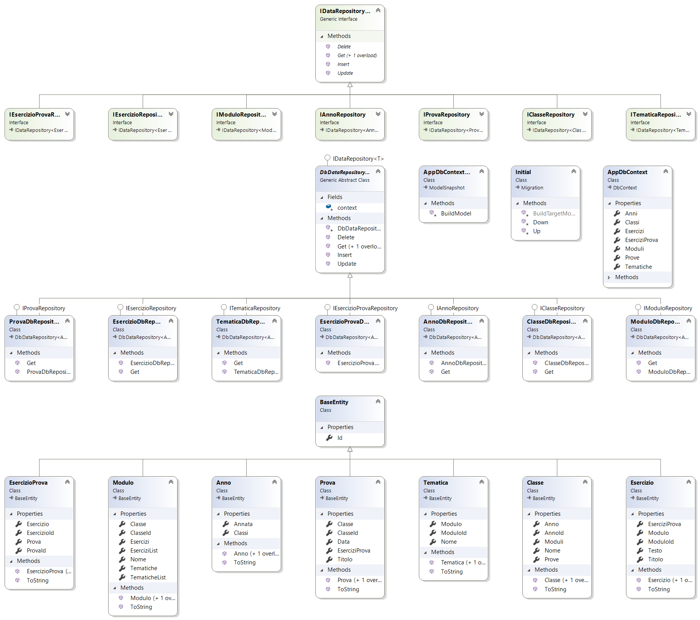

# Gestione Esercizi | Diario di lavoro - 19.12.2019

##### Gabriele Alessi

### Canobbio, 19.12.2019

## Lavori svolti

Oggi ho concluso la documentazione e di conseguenza ho stampato tutto concludendo il progetto. Per finire ciò ho riguardato tutto e generato i diagrammi delle classi.

| Orario | Lavori svolti |
| - | - |
|13:15 - 16:30 | Conclusione Documentazione |

## Problemi riscontrati e soluzioni adottate

Nessun problema riscontrato.

## Punto della situazione rispetto alla pianificazione

In linea con la pianificazione.

## Programma di massima per la prossima giornata di lavoro

Consegna progetto.
